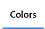

# HSV Color Pickers

这是一个用于开发 UWP 的库。
ColorPicker、RGBPicker、HSVPicker、WheelPicker、PalettePicker、StrawPicker、HexPicker、SwatchesPicker。


## 开始

|Key|Value|
|:-|:-|
|系统要求| Windows10 Creators Update 或更高|
|开发工具|Visual Studio 2017|
|编程语言|C#|
|显示语言|English|

  


在 Nuget 中搜索 “HSV Color” 并下载。
  


### 示例

运行 "TestApp".

```xaml
xmlns:hSVColorPickers="using:HSVColorPickers"


<hSVColorPickers:ColorPicker/>

<hSVColorPickers:RGBPicker/>
<hSVColorPickers:HSVPicker/>
<hSVColorPickers:WheelPicker/>

<hSVColorPickers:SwatchesPicker/>
<hSVColorPickers:HexPicker/>
<hSVColorPickers:AlphaPicker/>

<hSVColorPickers:PaletteHuePicker/>
<hSVColorPickers:PaletteSaturationPicker/>
<hSVColorPickers:PaletteValuePicker/>
 
<hSVColorPickers:CirclePicker/>
```
or 

```csharp
using HSVColorPickers;


new ColorPicker();

new RGBPicker();
new HSVPicker();
new WheelPicker();

new SwatchesPicker();
new HexPicker();
new AlphaPicker();

new PaletteHuePicker();
new PaletteSaturationPicker();
new PaletteValuePicker();
 
new CirclePicker(); 
```


## 了解更多

您可以从 Windows 10 商店中的演示应用程序中了解更多信息:<br/>
[FanKit](https://www.microsoft.com/store/productId/9PD2JJZQF524)


1.单击顶部栏中的 “Color” 项。
  


2.寻找简易示例。
    


玩得开心..
